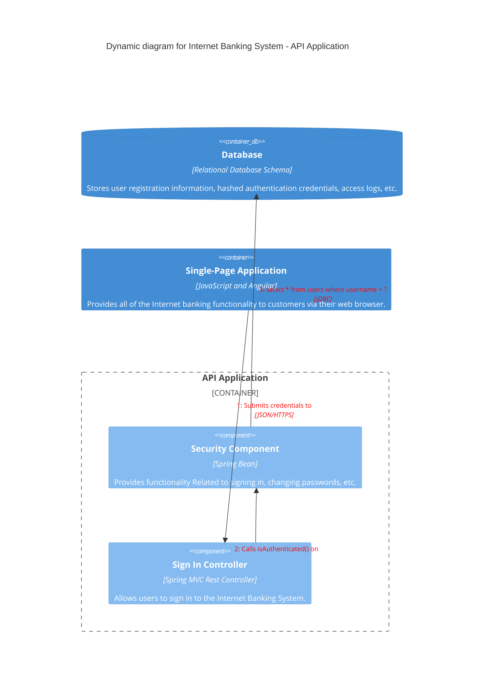

# Mumble App Team Ost


This App is the result of the second part of the CAS Frontend Engineering
Advanced course. It's our very own Twitter Clone - Mumble.

## Live Demo

The latest version of the App is available [here](https://app-team-ost.vercel.app/).

## Development



### Conventional Commits

The commit message should be structured as follows:

```console
<type>[optional scope]: <description>
```

Types:
| **Type** | **Description** |
| :------------- | :------------------------------------------------------------------------------------------------------ |
| **build** | Changes that affect the build system or external dependencies (example scopes: gulp, broccoli, npm) |
| **ci** | Changes to our CI configuration files and scripts |
| **docs** | Documentation only changes |
| **feat** | A new feature |
| **fix** | A bug fix |
| **perf** | A code change that improves performance |
| **refactor** | A code change that neither fixes a bug nor adds a feature |
| **style** | Changes that do not affect the meaning of the code (white-space, formatting, missing semi-colons, etc) |
| **test** | Adding missing tests or correcting existing tests |

Examples:

Commit message with scope:

```console
feat(lang): add German language
```

Commit message with ! to draw attention to breaking change:

```console
feat!: send an email to the customer when a product is shipped
```

## Maintainer

- [Martin Thomann](https://github.com/mthomann)
- [Nando Schär](https://github.com/nschaer92)
