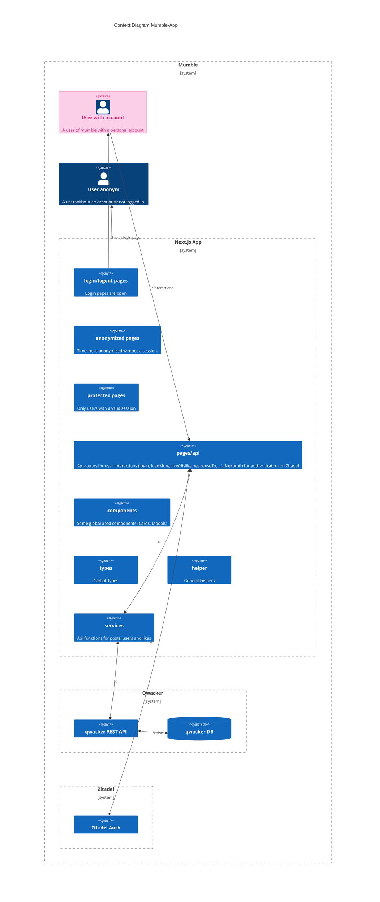

# Mumble App Team Ost - Architecture

The architecture diagram shows the context and the dependencies between users and different systems and system parts.

```mermaid
C4Dynamic
    title Context Diagram Mumble-App

    Boundary(b0, "Mumble") {
        Person(customerA, "User with account", "A user of mumble with a personal account")
        Person(customerB, "User anonym", "A user without an account or not logged in.")

        Boundary(b1, "Next.js App") {
          System(SystemPagesLogin, "login/logout pages", "Login pages are open")
          System(SystemPagesAnonym, "anonymized pages", "Timeline is anonymized wihtout a session.")
          System(SystemPagesProtected, "protected pages", "Only users with a valid session")
          System(SystemPagesApi, "pages/api", "Api-routes for user interactions (login, loadMore, like/dislike, responseTo, ...). NextAuth for authentication on Zitadel")
          System(SystemComponents, "components", "Some global used components (Cards, Modals)")
          System(SystemTypes, "types", "Global Types")
          System(SystemHelper, "helper", "General helpers")
          System(SystemServices, "services", "Api functions for posts, users and likes")
        }

        Boundary(b5, "Qwacker") {
          System(SystemAPI, "qwacker REST API")
          SystemDb(SystemDB, "qwacker DB")
        }
        Boundary(b6, "Zitadel") {
          System(SystemZitadel, "Zitadel Auth")
        }
      }

      Rel(customerA, SystemPagesApi, "interactions")
      Rel(SystemPagesLogin, customerA, "get")
      Rel(SystemPagesLogin, customerB, "only login page")
      BiRel(SystemPagesApi, SystemServices, "")
      BiRel(SystemServices, SystemAPI, "")
      BiRel(SystemAPI, SystemDB, "Uses")
      BiRel(SystemPagesApi, SystemZitadel, "")


      UpdateElementStyle(customerA, $fontColor="#db2777", $bgColor="#fbcfe8", $borderColor="#db2777")
      UpdateRelStyle(SystemPages, customerB, $textColor="red", $lineColor="red", $offsetX="5")

      UpdateLayoutConfig($c4ShapeInRow="3", $c4BoundaryInRow="1")
```
