# Architecture Rendering Strategies

With the right rendering strategy, a huge performance gain can be achieved. With new insights from development, the rendering strategies were iteratively adapted and optimized to the circumstances.

## Server Side Rendering (SSR)

We have chosen SSR for the pages where user data must be loaded. We have built our API services in such a way that we generate a Mumble from a post of the Qwacker API. This mumble also contains the author (user) information.

We use SSR for:

- Index (Timeline)
- Mumble Detailpapge
- Profilepage (My mumbles) -> (My likes are loaded CSR -> see below)

## Static Side Generation (SSG) / Incremental Static Regeneration (ISR)

For the timeline, as well as the Mumble detail page, a public version is also available, without user data. Since we do not need an authenticated server session for fetching this data, these pages can be generated statically.
With a revalidation of the pages every 5 seconds we can ensure that nevertheless always current pages are available for the users. This value can be adjusted with some experience to number of users, server power etc.

We use SSG/ISR for:

- Index-public (anonymized Timeline)
- Mumble Detailpage public
  The middleware decides whether an anonymized page or a page with user data is displayed to the user. More about this below.

## Client Side Rendering (CSR)

To speed up the initial page load, server side only loads what is initially displayed. For example, on the profile page, "My mumbles" are loaded server side, but "My likes" are loaded client side with SWR. The Liked mumbles are loaded immediately after the page load and are available for the user when clicking on the other tab.

## Static pages

Static pages are for example:

- Login/Logout/Register
- Error pages

## Next-Middleware/Next-Config

The **middleware** ensures that protected pages are only displayed with a valid session. If there is no valid session, the user is **redirected** to the login page.

If a user without a valid session opens the Timeline ("/") or a Mumble detail page ("/mumble/{id}"), there is a **rewrite** to the public pages:

```console
/index-public
/mumble-public/{id}
```

In the **next-config** there is a redirect for the index-public and mumble-public pages to

```console
/
/mumble/{id}
```

so that the correct URL is shown to the users.

## Custom Hooks

Custom hooks with SWR are used for loading more mumbles in the timeline and loading new mumbles with a refresh interval. When the user clicks the buttons "Load more" or "Load new mumbles", the data of these mumbles are already loaded and can be displayed immediately.

# Architecture Context and Access

The architecture diagram shows the context and the dependencies between users and different systems and system parts.

## Data and Qwacker REST-API access

### Service Layer

A service layer with various functions was created for fetching data from the Qwacker REST API. This ensures that the API is exchangeable and errors can be handled centrally.

### Server-side Data Fetching

Server-side requests go directly to the Qwacker REST API via this service layer.

### Client-side Data Fetching

All client-side requests are proxyed via the Next API. This makes the Qwacker API completely invisible to the user.

## Context Diagram

```mermaid
C4Dynamic
    title Context Diagram Mumble-App

    Boundary(b0, "Mumble") {
        Person(customerA, "Anonym User", "A user without an account or not logged in.")
        Person(customerB, "User with Session", "A user of mumble with a personal account")

        Boundary(b1, "Next.js App") {
          Boundary(b2, "Middleware") {
            System(SystemMiddleware, "Nextjs Middleware", "")
          }
          Boundary(b3, "Pages") {
            System(SystemPagesAnonym, "anonymized pages (ISR)", "Public Timeline, Mumble-Detail")
            System(SystemPagesProtected, "protected pages (SSR)", "Timeline, Mumble-Detail and Profile")
            System(SystemPagesAuth, "auth pages (Static)", "Login, Logout, Register")
          }
          Boundary(b4, "Services") {
            System(SystemComponents, "components", "Global used components (Cards, Lists, Modals)")
            System(SystemPagesApi, "pages/api", "Api-routes for user interactions")
            System(SystemHooks, "custom hooks", "Ex. Load-More, Load-New-Mumbles with refresh intervall")
            System(SystemHelper, "helper", "General helpers")
            System(SystemTypes, "types", "Global Types")
            System(SystemServices, "services/qwacker-api", "Api functions for posts, users and likes")
            System(SystemNextAuth, "next-auth", "Authorization with Zitadel")
          }

        }

        Boundary(b6, "External Services") {
          System(QwackerAPI, "qwacker REST API")
          SystemDb(QwackerDB, "qwacker DB")
          SystemDb(GoogleImage, "Google Image Storage")
          System(SystemZitadel, "Zitadel Auth")
        }
      }

      BiRel(SystemMiddleware, customerB, "")
      BiRel(SystemMiddleware, customerA, "")
      BiRel(SystemMiddleware, SystemPagesAuth, "Session")
      BiRel(SystemMiddleware, SystemPagesAnonym, "without Session")
      BiRel(SystemMiddleware, SystemPagesProtected, "with Session")

      BiRel(SystemPagesAnonym, SystemServices, "Server-Requests")
      BiRel(SystemPagesProtected, SystemServices, "Server-Request")
      BiRel(SystemPagesProtected, SystemPagesApi, "Client-Request")

      BiRel(SystemPagesApi, SystemServices, "")
      BiRel(SystemServices, QwackerAPI, "")
      BiRel(QwackerAPI, QwackerDB, "")
      BiRel(QwackerAPI, GoogleImage, "")
      BiRel(SystemNextAuth, SystemZitadel, "")

      UpdateElementStyle(customerB, $fontColor="#db2777", $bgColor="#fbcfe8", $borderColor="#db2777")
      UpdateRelStyle(SystemPagesAnonym, SystemServices, $textColor="red", $lineColor="red", $offsetX="5")
      UpdateRelStyle(SystemPagesProtected, SystemServices, $textColor="red", $lineColor="red", $offsetX="5")
      UpdateRelStyle(SystemPagesProtected, SystemPagesApi, $textColor="green", $lineColor="green", $offsetX="5")

      UpdateLayoutConfig($c4ShapeInRow="4", $c4BoundaryInRow="1")
```


